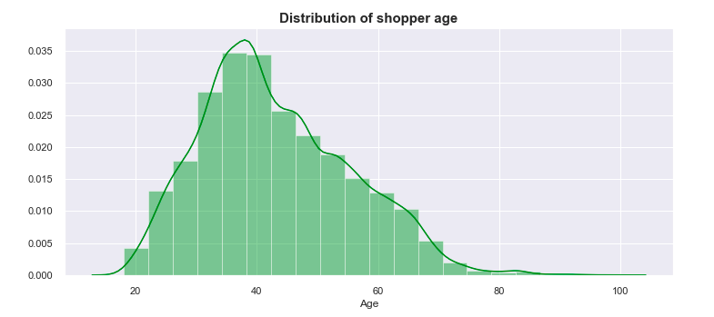
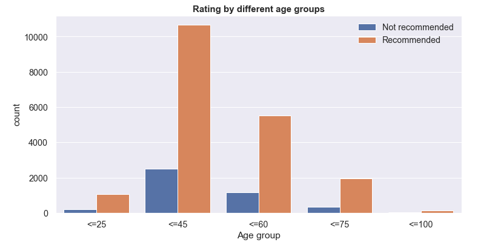
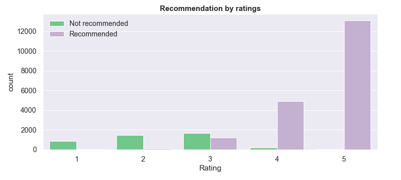
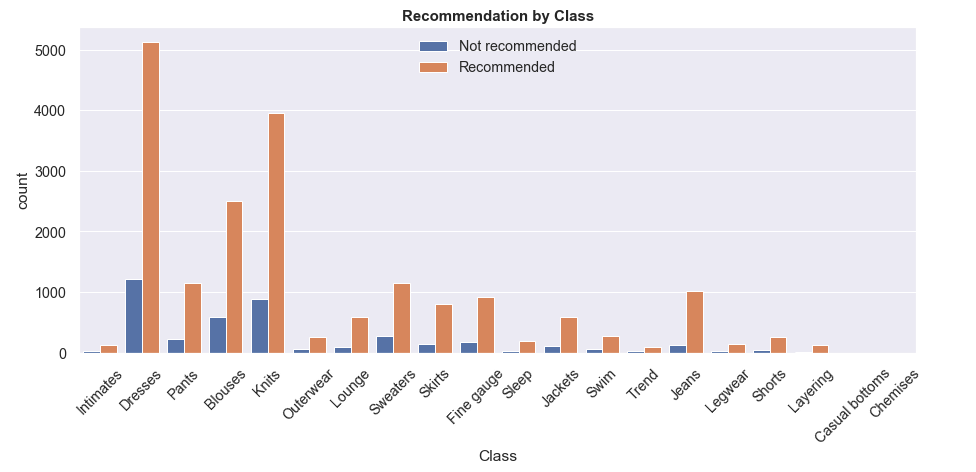
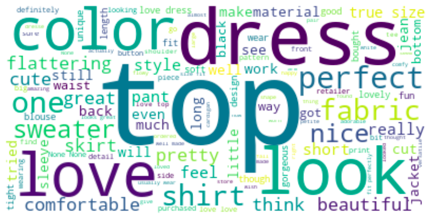

## Sentiment analysis - Women's ecommerce clothing reviews

### Context
Sentiment analysis is contextual mining of text which identifies and extracts subjective information in source material, 
and helping a business to understand the social sentiment of their brand, product or service while monitoring online conversations.

The purpose of this project is to build a machine learning model that predicts whether or not a customer would recommend a purchased item of 
clothing based solely on the customer's written review.

### About the dataset
This dataset includes 23,486 rows and 10 feature variables (clothing id, age, review title, review text, item rating, recommended IND, positive feedback count, 
division name, department name, and class name). Each row corresponds to a customer review.

### Kernel content
The kernel is divided into 4 separate parts: 

     1. Import libraries and load the dataset
     2. Exploratory Data Analysis (EDA): data imputation, variable analysis, and feature transformation
     3. Text preprocessing 
     4. Building sentiment classifier

### Findings
Below are some of the findings on the Women's ecommerce dataset:

* The majority of shoppers fell between the age of 25 and 55. Around 40 is when the histogram peaks.

* Shoppers between the age group of 25 and 45 gave the majority of online recommendation for clothing items

* The chart clearly shows that items having rating between 3-5 stars were recommended more often, which makes a lot of sense, as the higher the rating, the more likely the customers were happy with their purchase, and the more likely they are to recommend the item.

* Dresses, blouses, and knits are among the most common recommended items

* The above wordcloud showes the most common words in positive reviews. Words such as top, dress, love, look, color, perfect, comfortable, beautiful, flattering appears more often, which makes sense since these are the words that imply positive sentiment.

### Modeling
4 different machine learning models were used and compared to create a model that predicts whether or not a customer would recommend a purchased item of 
clothing based solely on the customer's written review.

The best performed model is Random Forest Classifier, with a accuracy score of about 86%. The next best model is Logistic Regression. In term of timing, Random Forest took the most time to execute. A lot of the time, it's the trade off between time and accuracy. In this case, since Random forest provided a significant boost in model performance, it's the best model out of the 4 that were used.
